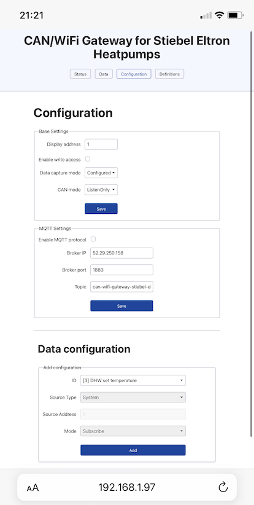

# CAN/WiFi Gateway for Stiebel Eltron Heatpumps
Gateway to communicate with Stiebel Eltron heat pump controllers via an HTTP-based API. It communicates with the heatpump controller using the native, proprietary CAN protocol and provides the features and data through a more integration friendly HTTP API to the outside. Developed for deployment on an ESP8266 board with a separate CAN adapter/bridge.

For a schematic and PCB layout to build a device able to run this go to https://github.com/simonlmn/can-wifi-gateway-hardware.

## Support

If you want to support this project, you can:

 * use it and provide feedback
 * fix bugs
 * develop improvements or new features
 * 

## Similar projects and references

Of course, this is not the only or even the first attempt to reverse engineer the CAN bus protocol of Stiebel Eltron devices and to build a custom gateway to integrate these into various smart home solutions or similar things. What follows is a list in no particular order of websites, blog posts or forum discussions which in one way or another helped to build this solution:

 * http://juerg5524.ch/
 * https://www.haustechnikdialog.de/Forum/t/79101/Stiebel-Eltron-WPC10-ueber-CAN-Bus-auslesen-steuern
 * https://elkement.blog/2016/08/03/hacking-my-heat-pump-part-1-can-bus-testing-with-uvr1611/
 * http://messpunkt.org/blog/?p=7
 * https://github.com/Hunv/can2mqtt/tree/d9925cabcf278f3237240f8a44b852395e5d3c1e/can2mqtt_core/can2mqtt_core/Translator/StiebelEltron
 * https://community.home-assistant.io/t/configured-my-esphome-with-mcp2515-can-bus-for-stiebel-eltron-heating-pump/366053

## Documentation

### Setup Guide

Pre-condition: you have built the necessary hardware (e.g. based on https://github.com/simonlmn/can-wifi-gateway-hardware) and have uploaded the `wifi-gateway` sketch to the ESP8266 NodeMCU board and the `serial-can-bridge` to a the Arduino Nano.

 1. Connect the gateway to your heatpump's CAN (aka BUS) terminals, which normally includes both the CAN H and L lines as well as the ground and +12V supply lines.
    
    Note: where you find these terminals depends on the heatpump model and setup. As CAN is a _bus_ system, you can basically connect to it at either end or between existing nodes. For example, directly at the heatpump controller or at/after a WPM or room control unit. Bus termination must be set accordingly at the ends only or otherwise the entire communication can break down!

 2. When the gateway has power, it will start up into _config mode_ as it does not have a WiFi configuration yet. It starts its own WiFi access point and will appear as `can-wifi-gw-<chip-id>`. The blue LED on the ESP8266 will blink slowly in this mode.

 3. Connect to the WiFi. It should automatically open a captive portal to configure the WiFi to connect to (e.g. your home network).

    If the captive portal does not automatically show up, you can manually open a browser and go to `192.168.4.1`.

    

 4. Save the configuration, the gateway will automatically restart and will try to connect to the configured WiFi from now on.

    If the connection fails (e.g. the entered WiFi password is wrong), it will start in _config mode_ again so you can fix the configuration (this will again be indicated by the slow blinking blue LED). It will automatically restart every 5 minutes though in order to prevent staying in _config mode_ if there was only a temporary connection problem.

 5. Find out which IP address was assigned to the gateway. This is typically shown on the administration interface of your WiFi router. The gateway will have the hostname `can-wifi-gw-<chip-id>`.

 6. Open the address in a browser (HTTP, not HTTPS!) and the administration UI will show up. The first screen shows the general status and diagnostic information. Especially the logs are useful to diagnose problems.

    

 7. Go to the "Configuration" screen and set the base settings to be able to interact with your heatpump:

    

    * "Display address": this must be a number between 1 and 4 and must be unique among all "displays" on the bus.
    
      Typically, the built in display on the heatpump will have address number 4, so choosing 1 or 2 should usually work. If you have room control units, address 1 or 2 may already used for those.

    * "Enable write access": if you want to set parameters or in general control your heatpump this must be enabled. Otherwise, this could be left disabled to prevent accidentally overwriting parameters.

    * "Data capture mode": should be set to "Configured".
    
      It controls which data is actually captured from the heatpump and can be changed to:
        * "None": collect no data at all
        * "Configured": collect only data which explicitly has been configured (in the section at the bottom of the "Configuration" screen).
        * "Defined": collect also data for which a definition is available (as shown on the "Definitions" screen). It will only capture these additional datapoints when some other components on the bus are sending/requesting them (e.g. when using the built-in display to view/change some parameters).
        * "Any": collect any data even when there is no definition. In this case, only raw values will be available for those, as the units and conversion function is not known.

    * "CAN mode": should be set to "Normal".
      
      It controls how the CAN module is set up:
        * "Normal": connect to the bus and allow receiving and sending messages.
        * "ListenOnly": connect to the bus and allow receiving messages only. This actually prevents any messages from being sent, so the gateway will only capture data which is actively sent by the heatpump controller or display units (as the gateway cannot send any request messages this way).
        
          Note: This is different from "Enable write access", as that setting only prevents writing to parameters, but still allows the gateway to request data from the heatpump controller.
        * "LoopBack": do not connect to the actual bus, but set up the module in "loop back" mode. Any message sent by the gateway will be returned as a received message. This is only useful for development purposes.

8. Save the base settings which will be immediately applied. You can check the logs on the "Status" screen if the settings were applied and if the CAN module was successfully set up (there should be a message like "SETUP OK 96 8 8 8 8 4 1 20000 64")

9. To set up which datapoints and parameters are going to be captured and available for writing by the gateway, go to the "Data configuration" section on the "Configuration" screen and add the desired IDs.

   Some IDs require to set the "Source Address" or the "Mode":

    * "Source Address": some sources can appear multiple times in the system and must be addressed individually. The only known case is the heating circuits: there are potentially two heating circuits which both may have the same datapoint/parameter IDs. To tell them apart, the first one has address 1 and the second one has address 2.
    * "Mode": if the selected ID is a writable parameter, you can decide if you
      * only want to "Subscribe" to it, meaning that it won't actually be available for writing (e.g. you only want to know the current value and see when it is changed through other means).
      * want it to be "Writable" only, meaning that it will be available for writing, but changes which are not communicated on the bus are not captured (some parameters are re-set/changed by the heatpump controller internally).
      * want it to be "Both".

   Currently, there is no way to load a bulk configuration of the datapoints via the UI. This is only available via directly using the REST API.

 10. After some data is configured, go to "Data" screen and see if/how the values are captured.

After this initial setup, the gateway should be ready to be integrated into, for example, the home automation system of your choice. There is also basic support for MQTT, which can also be congiured via the UI.